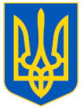

#  Symbols of Ukraine

A POV-Ray implementation of the Ukrainian trident (тризуб) and colors.

## Usage

1. Set `global_settings { assumed_gamma }`. If you are using POV-Ray 3.7 or later, this must be done *before* step 3, or you will get a parse error.

2. Declare `Ukr_Gamma` with the same value as your `assumed_gamma`. The default value is 1.

3. `#include "ukraine.inc"`

## Values

`UKR_C_AZURE` - Ukraine deep blue

`UKR_C_GOLD` - Ukraine yellow

`UKR_SMALL_LEFT` - the *x* value of the left edge of the shield

`UKR_SMALL_RIGHT` - the *x* value of the right edge of the shield

`UKR_SMALL_TOP` - the *y* value of the top of the shield

`UKR_SMALL_BOTTOM` - the *y* value of the bottom of the shield

## Macro

`Ukr_Make_Small_Arms()` - Returns the Ukrainian small coat of arms as an object: a blue shield emblazoned with the Ukrainian trident in yellow. The object is 0 to +1 deep in the *z* direction, and the current default finish is used.

## Objects

`Ukr_o_Small_Arms` - an untextured Ukrainian trident, including the shield border. The object is −1 to +1 deep in the *z* direction. At this time, the object is not suitable for transparent textures.

`Ukr_Small_Shield` - an untextured shield in the shape of the Ukrainian small coat of arms. The object is 0 to +1 deep in the *z* direction. At this time, the object is not suitable for transparent textures.

`Ukr_Small_Arms` - the Ukrainian small coat of arms: a blue shield object emblazoned with the Ukrainian trident in yellow. The object is 0 to +1 deep in the *z* direction, and the default finish at the time `ukraine.inc` was included is used.

## Pigment

Ukr_p_Small_Arms - a yellow Ukrainian trident on a blue background. This is an object pigment, with the trident −1 to +1 deep in the *z* direction.

## Sources

* [Verkhovna Rada of Ukraine](https://zakon.rada.gov.ua/laws/show/2137%D0%B0-12?lang=en)
* [DSTU 4512:2006, appendix A](https://uk.wikisource.org/wiki/%D0%94%D0%A1%D0%A2%D0%A3_4512:2006#appA) (Wikisource)
